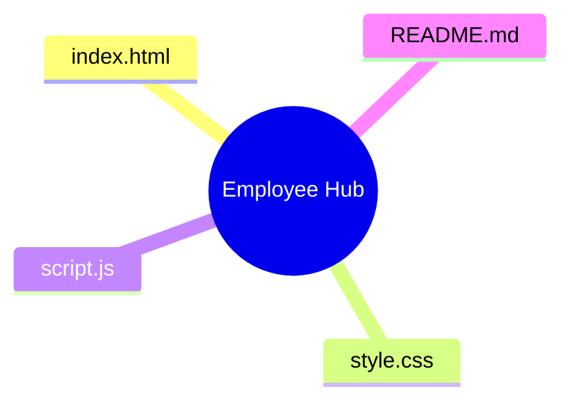

# 🚀 Employee Registration Hub

[](index.html)
[](https://opensource.org/licenses/MIT)
[](https://zencoder.ai)

Welcome to the **Employee Registration Hub**, a sleek, modern, and highly interactive onboarding portal. Designed for the modern workforce, this platform provides a seamless data collection experience with a focus on usability and aesthetics.

---

## ✨ Features

- 🎨 **Modern Glassmorphism UI**: A clean, airy design with subtle gradients and smooth transitions.
- 📱 **Fully Responsive**: Optimized for desktops, tablets, and smartphones.
- 🔍 **Live Summary Preview**: Real-time validation and summary generation before submission.
- 📂 **Multi-file Upload Support**: Easily attach resumes or government IDs.
- 🏗️ **Smart Layout**: Organized section blocks for Personal, Employment, and Additional details.
- 🖼️ **Lucide Icons**: Beautifully integrated iconography for better visual cues.

---

## 🛠️ Tech Stack

- **HTML5**: Semantic structure for accessibility.
- **CSS3**: Custom properties (variables), Flexbox, Grid, and Modern Gradients.
- **JavaScript (ES6+)**: Functional logic for form handling and DOM manipulation.
- **Lucide Icons**: Lightweight and customizable SVG icons.

---

## 🚀 Quick Start

1.  **Clone the Repository**:
    ```bash
    git clone https://github.com/yourusername/employee_registration_form.git
    ```
2.  **Open the Hub**:
    Simply open `index.html` in your favorite browser.

---

## 📂 Project Structure



- `index.html`: The core portal structure.
- `style.css`: The visual soul of the application.
- `script.js`: The engine behind form logic and interactivity.

---

## 🎨 Design Philosophy

We believe that enterprise forms shouldn't be boring. By combining **Manrope** typography with a soft palette of **Slate** and **Blue**, we've created an environment that feels welcoming and professional.

---

## 🤝 Contributing

Contributions are what make the open source community such an amazing place to learn, inspire, and create. Any contributions you make are **greatly appreciated**.

1. Fork the Project
2. Create your Feature Branch (`git checkout -b feature/AmazingFeature`)
3. Commit your Changes (`git commit -m 'Add some AmazingFeature'`)
4. Push to the Branch (`git push origin feature/AmazingFeature`)
5. Open a Pull Request

<div align="center">
    ⚠️ *For educational purposes only. Do not submit real personal or sensitive data.*
</div>
